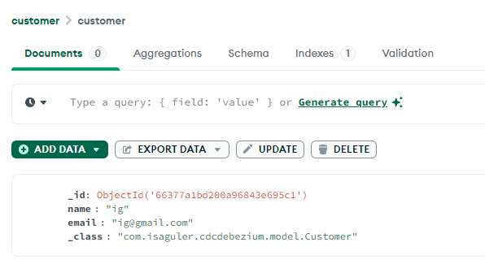
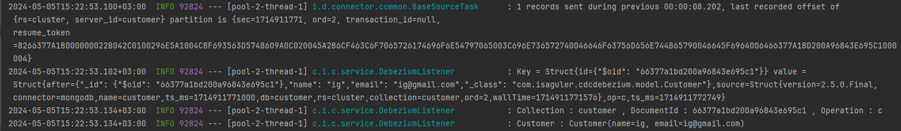

# CDC WITH EMBEDDED DEBEZIUM

[Debezium Connector for MongoDB](https://debezium.io/documentation/reference/2.6/connectors/mongodb.html)

```xml
<dependencies>
    <dependency>
        <groupId>io.debezium</groupId>
        <artifactId>debezium-api</artifactId>
        <version>2.5.0.Final</version>
    </dependency>
    <dependency>
        <groupId>io.debezium</groupId>
        <artifactId>debezium-embedded</artifactId>
        <version>2.5.0.Final</version>
    </dependency>
    <dependency>
        <groupId>io.debezium</groupId>
        <artifactId>debezium-connector-mongodb</artifactId>
        <version>2.5.0.Final</version>
    </dependency>
</dependencies>
```

MongoDB (Sharded) With Docker Compose

[bitnami/mongodb-sharded](https://hub.docker.com/r/bitnami/mongodb-sharded/)

### Sample

Save an Object to MongoDB

```json
{
  "name": "ig",
  "email": "ig@gmail.com"
}
```



CDC Result




