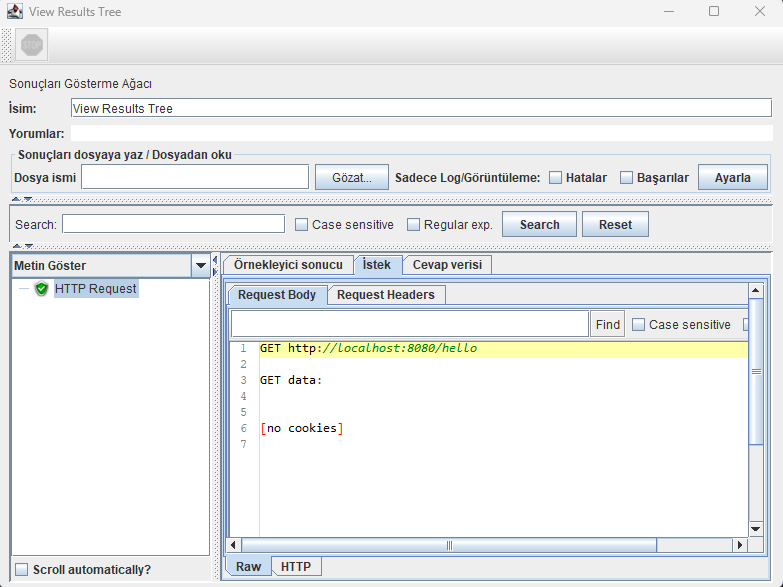
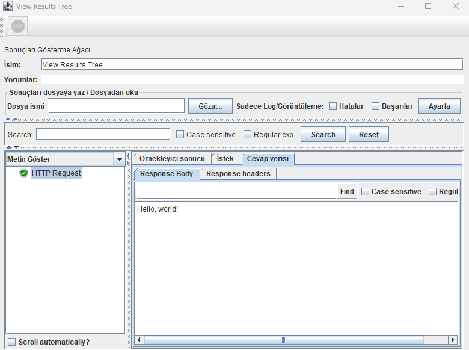
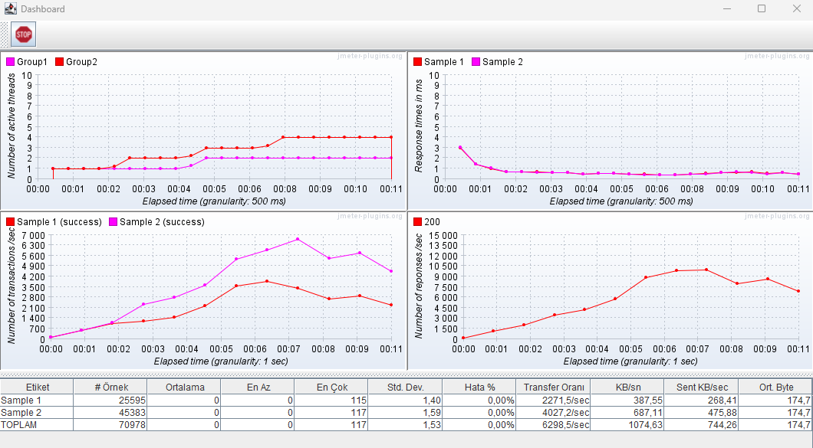

# Simple JMeter Performance Tests Java API

[JMeter DSL Java](https://abstracta.github.io/jmeter-java-dsl/)

```xml
<dependencies>
	<dependency>
        <groupId>us.abstracta.jmeter</groupId>
        <artifactId>jmeter-java-dsl</artifactId>
        <version>1.27</version>
        <scope>test</scope>
    </dependency>
    <dependency>
        <groupId>us.abstracta.jmeter</groupId>
        <artifactId>jmeter-java-dsl-dashboard</artifactId>
        <version>1.27</version>
        <scope>test</scope>
    </dependency>
</dependencies>
```

# Samples

- Visualizer




- Realtime Dashboard


